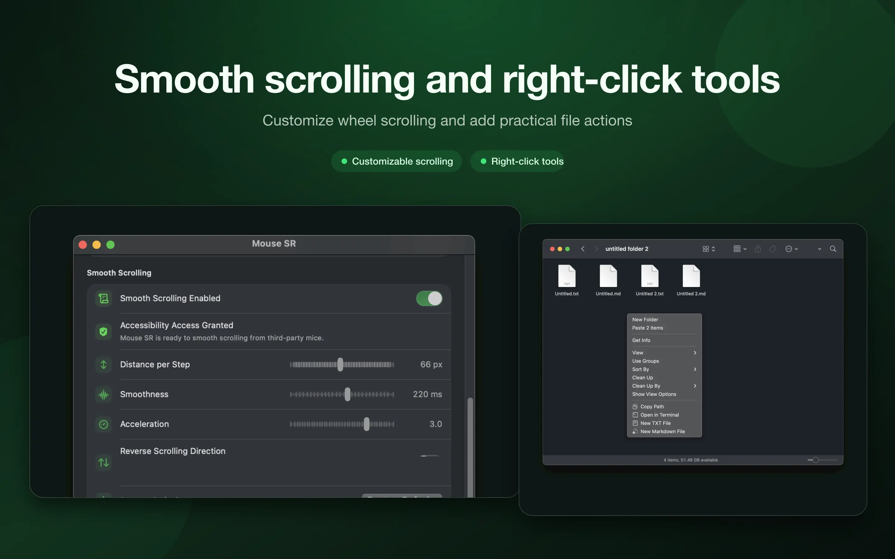
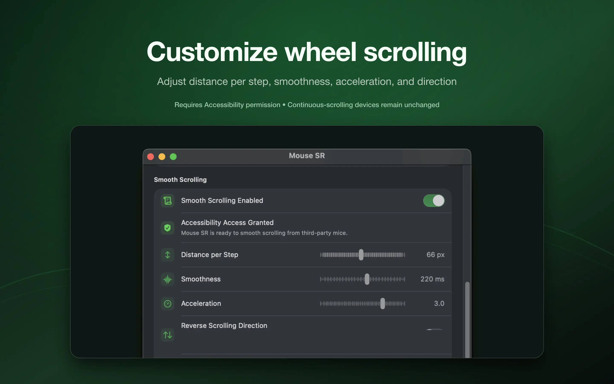
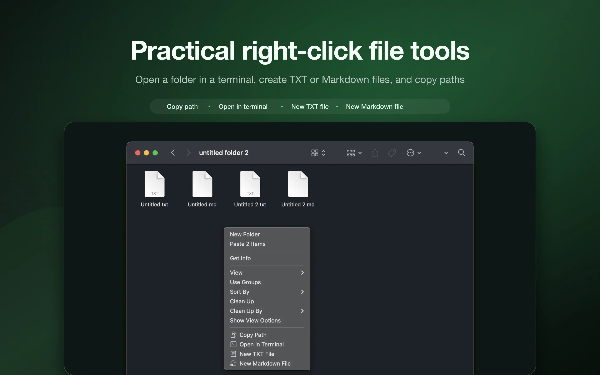

# Mouse SR

English | [简体中文](README.zh-CN.md)

Mouse SR is a small macOS utility that does two things well: it makes scrolling with a regular mouse feel smooth, and it adds a few useful actions to Finder's right-click menu.

If your mouse wheel moves the page in stiff, notched steps, Mouse SR turns those steps into continuous scrolling. You can adjust the distance, smoothness, acceleration, and direction to suit the way you work. Trackpads and other devices that already scroll continuously keep their original behavior.

## Download

[Download the latest release](./releases)

Mouse SR requires **macOS 15 or later**. Download the `.dmg`, open it, and drag Mouse SR into your Applications folder.

The first time you enable smooth scrolling, Mouse SR will guide you to grant Accessibility permission in System Settings. To use the Finder tools, you also need to enable the Mouse SR Finder extension and choose which folders may show its menu items.

Mouse SR Pro includes a free 7-day trial of every feature. The trial does not renew, and you will never be charged automatically. When it ends, smooth scrolling and Finder actions pause until you [buy a lifetime license](https://hp60.com/mouse-sr/). There is no subscription, and one license can activate up to three Macs.

## Smooth scrolling

Mouse SR turns notched mouse-wheel movement into continuous scrolling. You can adjust:

- Distance per wheel step
- Smoothness
- Acceleration during repeated scrolling
- Scroll direction

Mouse SR can stay in the menu bar, so you can turn it on or off whenever you need it.

## Finder right-click tools

After enabling the Finder extension, the available actions depend on where you right-click and what you select. You can:

- Open the current or selected folder in Terminal
- Create an empty TXT file
- Create an empty Markdown file
- Copy a file or folder path

You decide which folders show these actions, so other locations remain unchanged. If a new file would use an existing name, Mouse SR automatically chooses another available name.

## Privacy

Mouse and file processing happen locally on your Mac. Mouse SR does not upload mouse input, file contents, or file paths. Finder tools appear only in the folders you choose and their subfolders.

When you activate a lifetime license, the app sends the license key, a randomly generated installation ID, your Mac's name, and the app version to the license service. Periodic validation also sends basic license and app-version information. Mouse activity and file data are never sent.

Need help? [Contact support](https://hp60.com/about/contact/). You can also read the [Privacy Policy](https://hp60.com/about/privacy/) and [Terms of Use](https://hp60.com/about/terms/).
